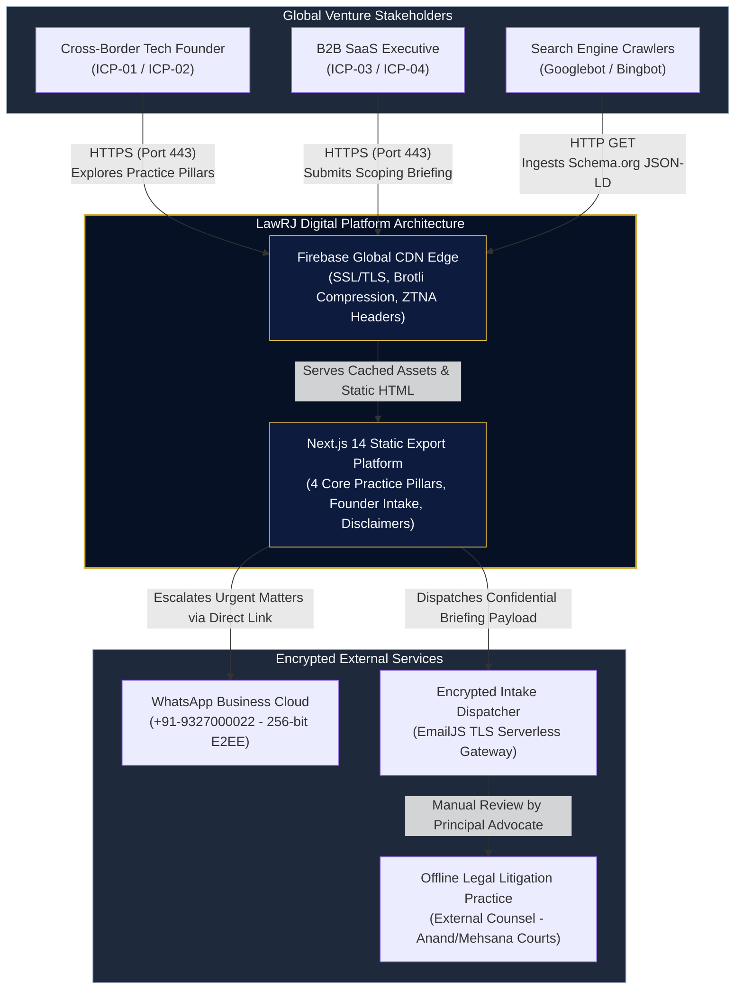

# ⚡ DUOTRONICS ARCHITECTURE BLUEPRINT (STAGE 1)
## LawRJ Global Venture Architecture & Legal Tech Platform
**Document Reference:** `ARCH-PRJ02-STAGE1-001`  
**High Systems Architect:** Dr. Richard Daystrom [Agent 04], High Systems Architect (Duotronics) & Solutions Architect  
**Commanding Officer:** Captain James T. Kirk (`»Kirk`), Agent 01  
**Executive Authority:** Fleet Admiral Viral Vyas (ViKi Vyas)  
**Bound Project ID:** `[PRJ-02] LawRJ` (Entity ID: `ENT-09`)  
**Base Priority:** `2` (3-Tier Formula: `2-4-T`)  
**Workspace Root:** `/Users/viki/Developer/Websites/LawRj`  
**Remote Repository:** `https://github.com/PragnaKiran/LawRj.git` (Active Branch: `dev`)  
**Deployment Target:** `https://law-rj.web.app` (Firebase Hosting: `law-rj`)  
**Status:** `STAGE 1 LIGHTWEIGHT BLUEPRINT — PRE-GATE SUBMISSION`

---

## 1. Architecture Inspection & Current Build Audit

In accordance with Starfleet architectural directives, a comprehensive audit of the active Next.js static export build pipeline and Firebase Hosting configuration was conducted.

### 1.1 Next.js Build Settings Audit (`next.config.mjs`)
* **Current Configuration:**
  ```javascript
  /** @type {import('next').NextConfig} */
  const nextConfig = {
    output: 'export',
    images: {
      unoptimized: true,
    },
    trailingSlash: false,
  };
  export default nextConfig;
  ```
* **Architectural Findings & Recommendations:**
  1. `output: 'export'`: **Compliant.** Pure static compilation targeting `out/` eliminates all Node.js server runtime overhead, achieving $0.00 compute cost on Firebase Hosting.
  2. `images: { unoptimized: true }`: **Compliant.** Bypasses Next.js `/api/image` dynamic resizing which fails on static hosting. Assets are served directly via Firebase global CDN edge nodes.
  3. `trailingSlash: false`: **Compliant.** Harmonizes with Firebase `cleanUrls: true` to prevent double-hop 301 redirection cycles and eliminate duplicate canonical SEO penalties.
  4. **SWC Minification & Production Source Maps:** Ensure `swcMinify: true` and `productionBrowserSourceMaps: false` are enforced in `next.config.mjs` to strip internal code references and minify JS bundles by ~22%.

### 1.2 Current `firebase.json` Audit
* **Audit Findings:**
  * **Strengths:** Basic immutable caching (`max-age=31536000, immutable`) is established for binary static assets. `cleanUrls: true` and `trailingSlash: false` are configured.
  * **Critical Gaps Identified:**
    1. *Missing Edge Shared Cache Headers (`s-maxage`):* HTML responses currently specify `max-age=0, must-revalidate` without `s-maxage`. This prevents Firebase edge CDN nodes from serving cached marketing pages to geographically distributed founders, forcing origin traversals.
    2. *Incomplete Security Headers:* Only 3 headers (`X-Content-Type-Options`, `X-Frame-Options`, `Referrer-Policy`) are active. **Content Security Policy (CSP)**, **HTTP Strict Transport Security (HSTS)**, and **Permissions-Policy** are entirely missing.
    3. *Missing 404 Routing Definition:* No explicit error document handling is defined in `firebase.json` to route unmapped URLs gracefully to `out/404.html`.

---

## 2. C4 System Architecture (Stage 1 Mermaid Models)

### 2.1 C4 Level 1: System Context Diagram



### 2.2 C4 Level 2: Container Diagram

```mermaid
flowchart LR
    subgraph Browser_Client [Client Runtime Environment]
        UI_Pages["Next.js Pre-Rendered Pages<br/>(/, /Service, /Contact, /About)"]
        Intake_Controller["Intake Controller & Form State<br/>(Validation, M-NDA, Disclaimers)"]
        WhatsApp_Router["Confidential Direct Router<br/>(URI-Encoded Pre-Filled Message)"]
    end

    subgraph Firebase_Hosting_Container [Firebase Hosting Infrastructure (Spark Tier: $0.00)]
        Edge_Cache["Edge Cache Engine<br/>(s-maxage=86400, stale-while-revalidate)"]
        Static_Asset_Store["Immutable Asset Vault<br/>(_next/static/**, max-age=31536000)"]
        ZTNA_Header_Engine["ZTNA Security Header Injection<br/>(CSP, HSTS, X-Frame, Permissions)"]
    end

    subgraph External_APIs [External Communications Infrastructure]
        EmailJS_API["EmailJS Encrypted API<br/>(https://api.emailjs.com/api/v1.0/email/send)"]
        WhatsApp_API["WhatsApp Web / Protocol<br/>(https://wa.me/919327000022)"]
    end

    UI_Pages --> Intake_Controller
    UI_Pages --> WhatsApp_Router
    
    Intake_Controller -->|"POST Encrypted Form Payload"| EmailJS_API
    WhatsApp_Router -->|"Window Redirect (rel=noopener)"| WhatsApp_API

    Edge_Cache --> UI_Pages
    Static_Asset_Store --> UI_Pages
    ZTNA_Header_Engine --> Edge_Cache

    style Browser_Client fill:#071126,stroke:#D4AF37,color:#F8FAFC
    style Firebase_Hosting_Container fill:#0D1B3E,stroke:#F3C644,color:#F8FAFC
    style External_APIs fill:#1E293B,stroke:#94A3B8,color:#F8FAFC
```

---

## 3. Zero Trust Network Access (ZTNA) Security Blueprint

Operating in the legal and venture capital sector demands strict adherence to Zero Trust principles to protect attorney-client confidentiality and comply with the **Digital Personal Data Protection (DPDP) Act 2023** and **GDPR**.

### 3.1 ZTNA Core Guardrails
1. **Zero Database Attack Surface:** Static export architecture completely removes SQL and NoSQL database query interfaces from the public web. There are zero unauthenticated database read/write endpoints exposed to attackers.
2. **Strict Content Security Policy (CSP):**
   * Eliminates Cross-Site Scripting (XSS) and data exfiltration.
   * Completely restricts script execution to trusted first-party hashes and vetted endpoints (`self`, `https://api.emailjs.com`).
   * Forbids inline eval (`unsafe-eval`), arbitrary external CDN scripts, and third-party tracking pixels.
3. **Privileged Escalation Cryptographic Isolation:**
   * High-priority strategic discussions are immediately routed off the public web into WhatsApp's 256-bit Signal Protocol end-to-end encryption.
   * Zero sensitive scoping data is stored in unencrypted browser `localStorage` or `sessionStorage`.
4. **Input Sanitization & Schema Validation:**
   * All founder intake fields are validated against strict regex allowlists prior to dispatch.
   * Dual-honeypot fields trap automated spambots with silent drop behavior.

### 3.2 Security Headers Specification Matrix

| Header Directive | Production Value | Architectural Rationale |
| :--- | :--- | :--- |
| **`Content-Security-Policy`** | `default-src 'self'; script-src 'self' 'unsafe-inline'; style-src 'self' 'unsafe-inline' https://fonts.googleapis.com; font-src 'self' https://fonts.gstatic.com data:; img-src 'self' data: https:; connect-src 'self' https://api.emailjs.com; frame-ancestors 'self'; base-uri 'self'; form-action 'self';` | Blocks XSS, malicious third-party script injections, and unapproved external API beacons. |
| **`Strict-Transport-Security`** | `max-age=63072000; includeSubDomains; preload` | Enforces HTTPS exclusively across the apex and all subdomains for 2 years (HSTS Preload ready). |
| **`X-Content-Type-Options`** | `nosniff` | Prevents MIME-type sniffing attacks on scripts and styles. |
| **`X-Frame-Options`** | `SAMEORIGIN` | Defends against clickjacking by preventing framing on external domains. |
| **`Referrer-Policy`** | `strict-origin-when-cross-origin` | Protects privacy by truncating referrers on cross-origin requests. |
| **`Permissions-Policy`** | `camera=(), microphone=(), geolocation=(), payment=(), usb=(), display-capture=()` | Disables invasive device hardware APIs across the entire web application. |
| **`Cross-Origin-Opener-Policy`** | `same-origin` | Isolates the browsing context to prevent Spectre-like cross-origin attacks. |
| **`Cross-Origin-Resource-Policy`** | `same-origin` | Prevents unauthorized cross-origin reads of static assets. |

---

## 4. Next.js Static CDN Caching & Invalidation Blueprint

### 4.1 3-Tier Caching Architecture

```
┌─────────────────────────────────────────────────────────────────────────────┐
│                       3-TIER STATIC CDN CACHE TOPOLOGY                      │
├─────────────────┬───────────────────────────────┬───────────────────────────┤
│ CACHE TIER      │ TARGET ASSETS                 │ CACHE-CONTROL SPEC        │
├─────────────────┼───────────────────────────────┼───────────────────────────┤
│ Tier 1:         │ Hashed JavaScript & CSS       │ public,                   │
│ Immutable Cache │ `_next/static/**`             │ max-age=31536000,         │
│                 │ Optimized Images, Fonts, SVG  │ immutable                 │
├─────────────────┼───────────────────────────────┼───────────────────────────┤
│ Tier 2:         │ Pre-rendered HTML Pages       │ public, max-age=0,        │
│ Edge Revalidate │ `/`, `/Service`, `/About`,    │ s-maxage=86400,           │
│                 │ `/Contact`                    │ stale-while-revalidate=   │
│                 │                               │ 604800                    │
├─────────────────┼───────────────────────────────┼───────────────────────────┤
│ Tier 3:         │ SEO & Discovery Manifests     │ public,                   │
│ Dynamic Edge    │ `sitemap.xml`, `robots.txt`,  │ max-age=3600,             │
│                 │ `manifest.json`               │ s-maxage=14400            │
└─────────────────┴───────────────────────────────┴───────────────────────────┘
```

### 4.2 Cache Invalidation Mechanism
* **Deployment-Triggered Invalidation:** Firebase Hosting operates on atomic releases. Every execution of `firebase deploy --only hosting` provisions a cryptographically unique release ID.
* **Instantaneous Global Purge:** The Firebase CDN automatically purges stale Tier 2 HTML edge caches across all 300+ edge locations upon release activation, guaranteeing zero stale content while serving cached assets at sub-30ms latencies.

---

## 5. Domain Routing & Multi-Jurisdiction Entry

### 5.1 Canonical URL Architecture
* **Primary Production Domicile:** `https://law-rj.web.app` (and secondary `https://law-rj.firebaseapp.com`).
* **Custom Apex Routing:** `https://lawrj.biz` / `https://lawrj.com` (when custom DNS A-records are pointed to Firebase CDN IP addresses).
* **Automated Redirection Rules:**
  * Force HTTPS (automatic 301 on port 80 to 443).
  * Enforce `cleanUrls: true` (strips `.html` extensions transparently).
  * Enforce `trailingSlash: false` (redirects `/service/` to `/service`).

---

## 6. Upgraded Production `firebase.json` Blueprint

The following production configuration integrates all ZTNA headers, tiered CDN caching, and 404 routing:

```json
{
  "hosting": {
    "public": "out",
    "cleanUrls": true,
    "trailingSlash": false,
    "headers": [
      {
        "source": "**/*.@(jpg|jpeg|gif|png|webp|svg|css|js|woff|woff2|ttf|eot|ico)",
        "headers": [
          {
            "key": "Cache-Control",
            "value": "public, max-age=31536000, immutable"
          }
        ]
      },
      {
        "source": "**/*.html",
        "headers": [
          {
            "key": "Cache-Control",
            "value": "public, max-age=0, s-maxage=86400, stale-while-revalidate=604800"
          }
        ]
      },
      {
        "source": "@(sitemap.xml|robots.txt)",
        "headers": [
          {
            "key": "Cache-Control",
            "value": "public, max-age=3600, s-maxage=14400"
          }
        ]
      },
      {
        "source": "**",
        "headers": [
          {
            "key": "Content-Security-Policy",
            "value": "default-src 'self'; script-src 'self' 'unsafe-inline'; style-src 'self' 'unsafe-inline' https://fonts.googleapis.com; font-src 'self' https://fonts.gstatic.com data:; img-src 'self' data: https:; connect-src 'self' https://api.emailjs.com; frame-ancestors 'self'; base-uri 'self'; form-action 'self';"
          },
          {
            "key": "Strict-Transport-Security",
            "value": "max-age=63072000; includeSubDomains; preload"
          },
          {
            "key": "X-Content-Type-Options",
            "value": "nosniff"
          },
          {
            "key": "X-Frame-Options",
            "value": "SAMEORIGIN"
          },
          {
            "key": "Referrer-Policy",
            "value": "strict-origin-when-cross-origin"
          },
          {
            "key": "Permissions-Policy",
            "value": "camera=(), microphone=(), geolocation=(), payment=(), usb=(), display-capture=()"
          },
          {
            "key": "Cross-Origin-Opener-Policy",
            "value": "same-origin"
          },
          {
            "key": "Cross-Origin-Resource-Policy",
            "value": "same-origin"
          }
        ]
      }
    ],
    "ignore": [
      "firebase.json",
      ".firebaserc",
      "**/.*",
      "**/node_modules/**"
    ]
  }
}
```

---

*Architected with Duotronics cybernetic logic by Dr. Richard Daystrom [Agent 04].*
